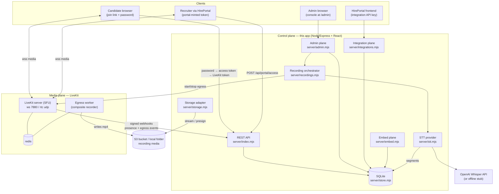
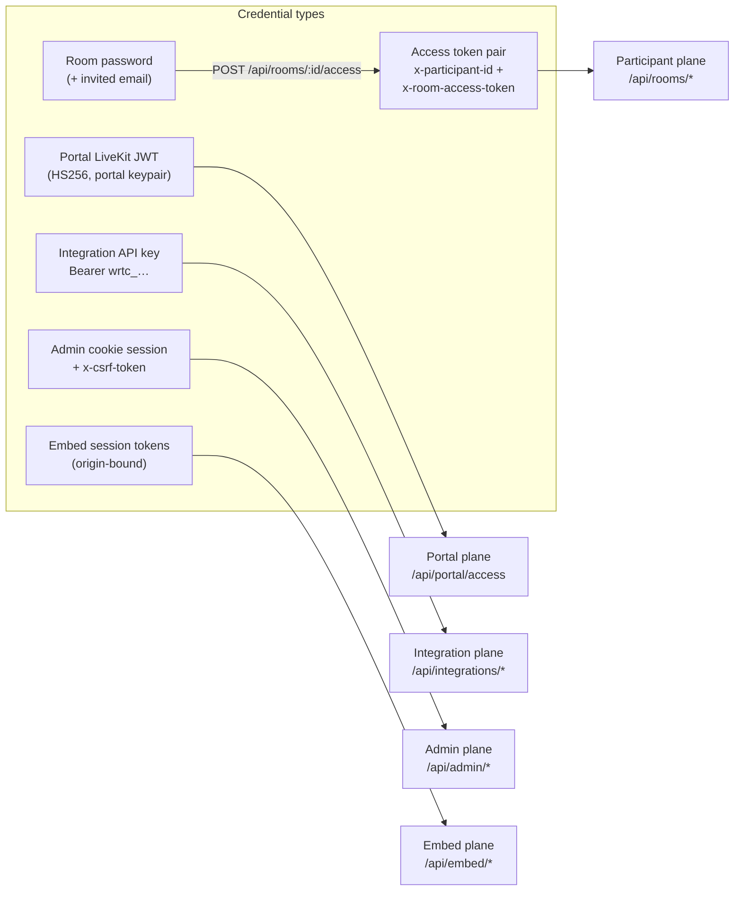
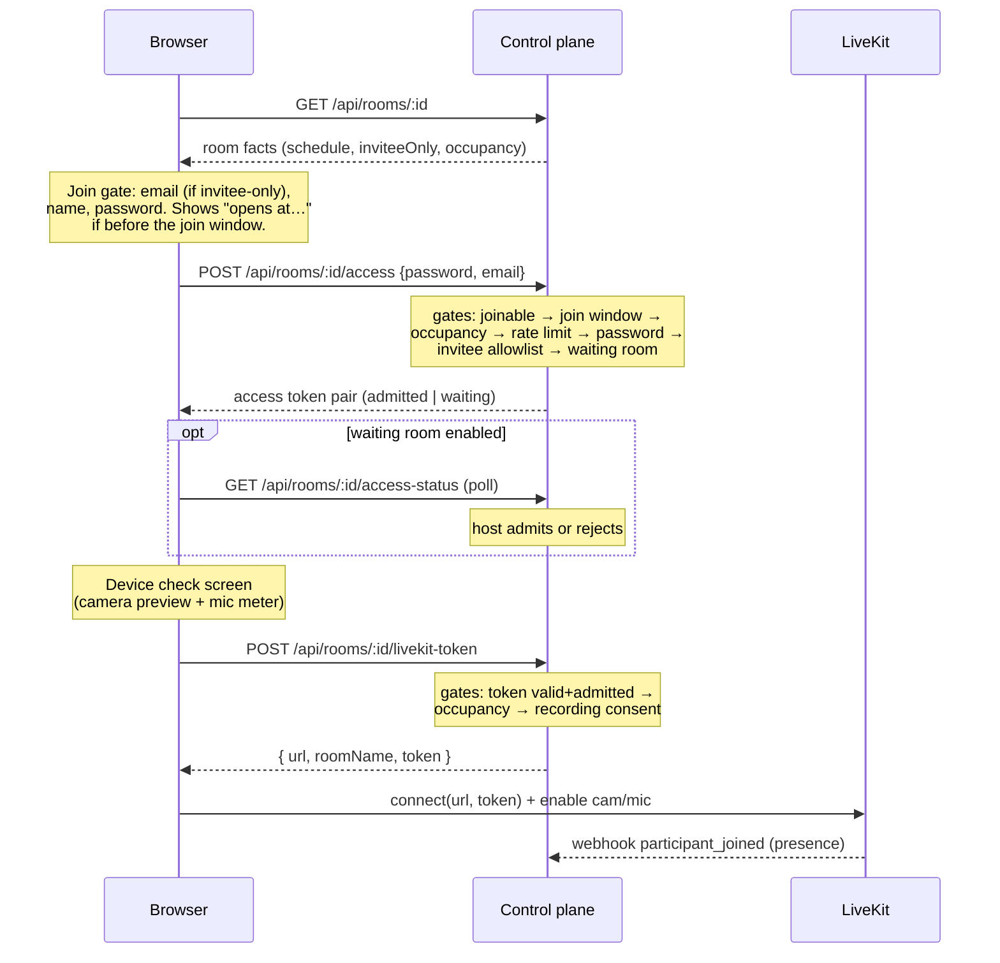
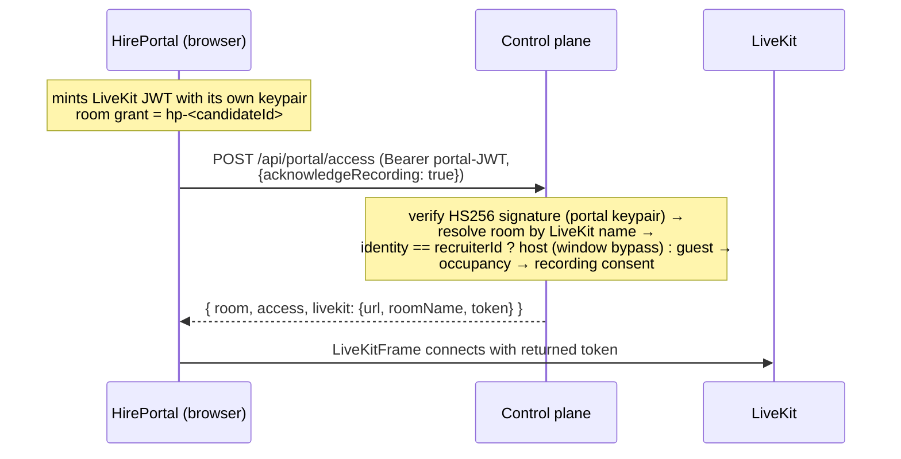
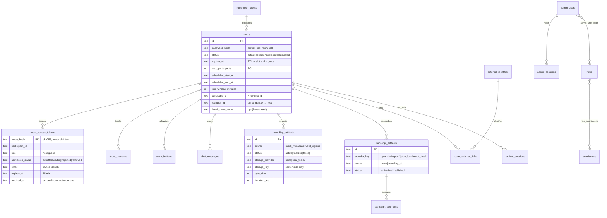

# InterviewRooms — Complete Documentation

Self-hosted interview video service for HirePortal: a daily.co-style platform with
scheduled invite-only rooms, consent-gated recording, post-call transcripts, an
admin console, and a server-to-server integration API — running on your own
infrastructure with a LiveKit media plane.

> Companion docs: [README](README.md) (quick start) ·
> [HirePortal contract](docs/integration/hireportal-contract.md) ·
> [AI-builder prompt](docs/integration/hireportal-ai-prompt.md) ·
> [AWS deploy notes](docs/release/aws-deploy.md) ·
> live interactive API reference at `/api/admin/docs/` (admin login required).

---

## 1. System overview



The **control plane** (this repo) owns identity, access rules, scheduling,
consent, artifacts, and audit. The **media plane** (LiveKit + egress + redis,
run via `docker-compose.livekit.yml`) carries audio/video and records it. Media
bytes never touch the app process — egress writes directly to storage, and the
app streams/presigns on playback.

### Feature summary

| Area | What exists |
|---|---|
| Rooms | Password-protected, up to 5 participants, per-room policy (waiting room, auto-admit), 24h TTL or scheduled slot + overrun grace |
| Interview mapping | `candidate_id`, `recruiter_id`, invitee email allowlist, scheduled slot with join window (guests can join only X min before start; hosts bypass) |
| Media | LiveKit SFU: camera/mic, screen share, mute, adaptive streaming, TURN (via LiveKit), reconnects |
| Recording | LiveKit composite egress → local folder (dev) or S3 (prod); acknowledge-to-enter consent; playback/download behind RBAC; auto-stop on room end |
| Transcripts | Post-call STT of finalized recordings (OpenAI Whisper or offline stub); segments with redact/delete/export; bounded retries + manual re-run |
| Chat | Realtime over LiveKit data channel; optional retained history with moderation (redact/delete/export) |
| Admin console | Zoom-style SaaS UI: rooms table, tabbed room detail, global recordings/transcripts tables, integrations, audit log, deployment guide, interactive API docs |
| Integration API | Bearer-key server-to-server: provision interview rooms, read room status (occupancy + artifact summaries) |
| Portal trust | HirePortal-minted LiveKit JWTs accepted as login proof; recruiters auto-host |
| Security | scrypt hashing, short-lived opaque tokens, RBAC (4 roles / 40+ permissions), CSRF, strict CSP, rate limits everywhere, immutable audit log |

---

## 2. Repository layout

```
server/                 Control plane (Node 24+, ESM)
  index.mjs             Express app: public/participant routes, portal access,
                        LiveKit webhooks, CORS, CSP, router mounting
  store.mjs             SQLite schema + ALL database logic (single writer module)
  admin.mjs             Admin router (auth, RBAC, rooms, artifacts, docs UI)
                        + participant-control router (chat, consents, waiting)
  integrations.mjs      Bearer-key integration API
  embed.mjs             Origin-bound iframe session API
  livekit.mjs           LiveKit SDK wrapper: tokens, portal JWT verify,
                        room service, egress, webhook receiver
  recordings.mjs        Recording pipeline orchestration (egress ↔ store ↔ STT)
  storage.mjs           Media storage adapter: local folder | S3 (presigned GET)
  stt.mjs               Speech-to-text providers: openai | stub
  openapi.mjs           Hand-maintained OpenAPI 3.1 spec (drift-tested)
  rate-limit.mjs        Token-bucket rate limiter

src/                    Frontend (React 19 + Vite, react-router)
  main.jsx              Router entry
  styles.css            Design system (tokens + all component styles)
  lib/api.js            fetch helpers, formatters, clipboard
  ui/kit.jsx            Primitives: Tabs, Modal, Toasts, DataTable, badges…
  ui/icons.jsx          Inline SVG icon set
  pages/public.jsx      Landing, join gate, waiting room, device check
  pages/call.jsx        In-call experience (LiveKit client)
  admin/portal.jsx      Admin session context, login/setup, app shell, routes
  admin/rooms.jsx       Rooms table + create modal
  admin/room-detail.jsx Tabbed room detail (details/recordings/transcripts/…)
  admin/misc-pages.jsx  Global recordings/transcripts, integrations (+ guide),
                        audit, profile
  admin/deployment.jsx  AWS hosting guide page
  embed-sdk.js, sdk/    Browser embed SDK (postMessage helpers, iframe surface)

livekit/                LiveKit server + egress configs (dev defaults)
docker-compose.livekit.yml  Local media plane (livekit + egress + redis)
tests/                  node:test suites (run against their own SQLite file)
docs/
  issues/               TASK-00xx issue/exploration/plan documents
  integration/          HirePortal contract + AI-builder prompt
  release/              AWS deploy notes, release checklists
data/                   SQLite database + local recordings (gitignored)
```

---

## 3. The five API planes and authentication



| Plane | Auth | Purpose |
|---|---|---|
| **Participant** | password → 15-min opaque token pair (revoked on disconnect/room end) | join flow, media credentials, chat, consents, waiting room, host end |
| **Portal** | HirePortal-minted LiveKit JWT — the signature *is* the login proof | one-call auto-admission returning app + media credentials |
| **Integration** | bearer API key (scrypt-hashed at rest; scopes `rooms:create/read/link`, `webhooks:local_record`) | provision interview rooms, poll room status |
| **Admin** | HttpOnly cookie session (8h TTL, 45m idle) + CSRF header on mutations + per-permission RBAC | everything operational |
| **Embed** | admin-issued one-time bootstrap token → exchanged session token, exact-origin bound | iframe surface |

Errors everywhere share one shape: `{ error, message }` where `error` is a
stable machine-readable code (`wrong_password`, `room_not_open`,
`recording_consent_required`, …).

---

## 4. Join flows

### 4.1 Direct link (candidate / any invitee)



Rejoin after leaving repeats the access call (tokens are revoked on
disconnect) — the password is the re-entry credential.

### 4.2 Portal join (recruiter or candidate signed into HirePortal)



The same portal keypair is registered in the LiveKit server's `keys:` config,
so the portal's self-minted token can also connect **directly** to LiveKit —
a zero-code fallback that skips control-plane gates (consent, join window,
presence bookkeeping). The `/api/portal/access` path is the recommended one.

---

## 5. Recording & transcription pipeline

```mermaid
sequenceDiagram
    participant A as Admin console
    participant API as Control plane
    participant LK as LiveKit egress
    participant S as Storage (S3/local)
    participant STT as STT provider

    A->>API: POST …/recordings/start (recordings:manage)
    API->>API: create artifact (source=livekit_egress, status=active)
    API->>LK: StartRoomCompositeEgress(roomName, fileOutput)
    LK->>S: writes MP4 (grid composite of all participants)
    Note over API: room end auto-stops egress;<br/>or admin POST …/:id/stop
    LK-->>API: webhook egress_ended (size, duration)
    API->>API: finalize artifact (byte_size, duration_ms)
    API->>STT: transcribe(media) — reads from storage
    STT-->>API: timed segments
    API->>API: transcript artifact (source=recording_stt) + segments
    Note over A: playback via GET …/recordings/:id/media<br/>(stream local / 302 presigned S3),<br/>transcript view/export/redact in console
```

- **Consent is acknowledge-to-enter**: when a room has recording enabled, the
  media-credential endpoint refuses (`recording_consent_required`) until the
  participant acknowledges the current notice version. Declining keeps the
  room closed for them. Consent is stored per participant per notice version.
- STT failures retry with bounds (`WEBRTC_STT_MAX_ATTEMPTS`, default 3) and can
  be re-run manually (`POST …/recordings/:id/transcribe`).
- Storage keys never appear in any API projection; playback goes through the
  RBAC-gated media endpoint (`recordings:playback`).

---

## 6. Data model

SQLite via `node:sqlite`, single database file (`WEBRTC_DB_PATH`, default
`data/webrtc.sqlite`). Migrations run automatically at startup:
`addColumnIfMissing` for new columns and a one-time table rebuild to widen
CHECK enums (`rebuildTableForCheck` in store.mjs). Core tables:



Supporting tables not shown: per-room settings (`room_chat_settings`,
`room_transcript_settings`, `room_recording_settings`, `room_embed_settings`),
consents (`participant_transcript_consents`, `participant_recording_consents`,
unique per room+participant+notice version), `audit_events` (immutable,
bodies never stored), `room_lifecycle_events`, `webhook_delivery_attempts`
(local-mock outbound records), `external_systems`, `agents`.

---

## 7. Frontend

Two apps in one bundle, split by route in [src/main.jsx](src/main.jsx):

### Public (`/`, `/rooms/:roomId`)
- **Landing** — join-by-link/ID card + instant quick-room creation.
- **Join gate** — centered card: invited email (when invitee-only), name,
  password; shows the join-window "opens at" notice; waiting-room state polls
  admission every 2s.
- **Device check** — camera preview + live mic level meter (WebAudio) before
  any connection; preflight tracks are released before LiveKit acquires its own.
- **Call** ([src/pages/call.jsx](src/pages/call.jsx)) — dark Zoom-style stage:
  participant grid (screen share takes the tile when present), self PiP,
  labeled control bar (mute / video / share / chat / people / end / leave),
  collapsible chat panel (LiveKit data channel + retained history) with unread
  badge, people panel with host waiting-room admit/reject, REC indicator +
  call timer, consent gate rendered in-stage.

### Admin (`/admin/*`)
- **Login/setup** — bootstrap login → forced password rotation → session.
- **Shell** — permission-filtered sidebar (Rooms, Recordings, Transcripts,
  Integrations, Deployment, Audit log, Profile) + avatar menu.
- **Rooms** — Upcoming/Previous/All tabs, search (matches candidate/recruiter
  ids), sortable table, create-room modal (schedule, join window, invitees,
  ids, participant cap).
- **Room detail** — stat cards + lifecycle actions in the header; tabs:
  Details (facts + policy toggles + interview-mapping editor), Recordings
  (start/stop/play/transcribe/delete), Transcripts (segments modal with
  redact/delete, JSON export), Chat (moderation), Waiting room, Embed
  (origins + sessions), Audit (lifecycle + events).
- **Global tables** — all recordings / transcripts across rooms.
- **Integrations** — API clients (key shown once), HirePortal integration
  guide with a pre-filled AI-builder prompt, link to the interactive API docs.
- **Deployment** — full AWS hosting guide with copyable configs.
- **API docs** — self-hosted Swagger UI at `/api/admin/docs/` rendering the
  OpenAPI 3.1 spec (76 operations), with working "Try it out".

Design system: hand-rolled CSS tokens in [src/styles.css](src/styles.css)
(brand blue `#0b5cff`, light admin surfaces, dark call stage). No CSS
framework; icons are inline SVG.

---

## 8. Security model

| Layer | Mechanism |
|---|---|
| Passwords | scrypt with per-room / per-user salts; timing-safe comparison; local bootstrap password refused in production |
| Participant tokens | 32-byte opaque, stored as sha256, 15-min TTL, revoked on disconnect and room end |
| Invitee allowlist | checked **after** the password so invitations cannot be enumerated |
| Join window | enforced in `assertRoomJoinable` — one gate covering info/access/media paths; hosts and admins bypass |
| Admin sessions | HttpOnly SameSite cookie scoped to `/api/admin`, server-side session rows, idle + absolute timeouts |
| CSRF | random token per session, required as `x-csrf-token` on every admin mutation |
| RBAC | roles `platform_admin`, `operator`, `support_reviewer`, `auditor` over 40+ granular permissions (`rooms:*`, `recordings:*`, `transcripts:*`, `chat:*`, `embed:*`, `integrations:*`, `audit:view`, …) |
| Integration keys | `wrtc_` prefix + 32 random bytes, scrypt-hashed at rest, scoped, revocable, optional origin allowlist |
| Rate limits | room creation, access attempts, password tries, chat, admin login, integration auth, transcript segments — all token-bucket per key/IP |
| CSP | `default-src 'self'`; `frame-ancestors 'none'` except the embed route (exact origins); `style-src 'unsafe-inline'` only on the API-docs route |
| CORS | disabled unless the origin is in `WEBRTC_CORS_ORIGINS` (reflected exact-match, no credentials header) |
| Audit | immutable `audit_events` for every consequential action; message/segment bodies never logged; IP/UA stored hashed |
| Media | LiveKit tokens minted only after all control-plane gates; recordings' storage keys never leave the server; S3 playback via short-lived presigned URLs |

---

## 9. HirePortal integration

Three touchpoints, all browser-callable (the portal has no backend):

1. **Provisioning** — `POST /api/integrations/rooms` (bearer key) with
   `candidateId`, `recruiterId`, invitee email, schedule → store `room.id` +
   `shareUrl` on the candidate record.
2. **Joining** — portal mints its usual LiveKit JWT → `POST /api/portal/access`
   → connect the existing `LiveKitFrame` with the **returned** token. Room
   resolution works because both sides derive the same LiveKit room name:
   `('hp-' + candidateId alphanumeric-only lowercased).slice(0, 40)`.
3. **Results** — `GET /api/integrations/rooms/:roomId` for occupancy and
   recording/transcript status; fold into the portal's `ai_summary`.

Setup: create an API client (admin → Integrations), add the portal origin to
`WEBRTC_CORS_ORIGINS`, and make the portal's LiveKit key/secret equal
`WEBRTC_PORTAL_API_KEY/SECRET` (also registered in the LiveKit server's
`keys:`). The Integrations page generates a paste-ready prompt for the
portal's AI builder, pre-filled with the deployment's URLs. Full contract:
[docs/integration/hireportal-contract.md](docs/integration/hireportal-contract.md).

---

## 10. Configuration reference

| Variable | Default | Purpose |
|---|---|---|
| `PORT` / `HOST` | `4321` / `127.0.0.1` (prod `0.0.0.0`) | API bind |
| `WEBRTC_PUBLIC_ORIGIN` | — | canonical origin; requests to other hosts are rejected |
| `WEBRTC_DB_PATH` | `data/webrtc.sqlite` | SQLite location (mount durable volume in prod) |
| `WEBRTC_LIVEKIT_URL` | — | LiveKit ws(s) URL; unset = media disabled ("Media server offline") |
| `WEBRTC_LIVEKIT_API_KEY/SECRET` | — | this app's LiveKit keypair (tokens, egress, webhooks) |
| `WEBRTC_PORTAL_API_KEY/SECRET` | — | HirePortal's keypair; portal JWTs verified against it |
| `WEBRTC_STORAGE_MODE` | `local` | `local` (data/recordings) or `s3` |
| `WEBRTC_S3_BUCKET/REGION/ACCESS_KEY/SECRET_KEY/ENDPOINT` | — | S3-compatible storage |
| `WEBRTC_S3_PRESIGN_TTL_SECONDS` | `900` | playback URL lifetime |
| `WEBRTC_STT_PROVIDER` | `stub` (or `openai` if key set) | post-call transcription provider |
| `WEBRTC_OPENAI_API_KEY` / `WEBRTC_STT_MODEL` | — / `whisper-1` | Whisper credentials |
| `WEBRTC_CORS_ORIGINS` | — | comma-separated browser origins (the portal) |
| `WEBRTC_EMBED_ALLOW_REMOTE_ORIGINS` | `0` | allow https non-localhost embed origins |
| `WEBRTC_ROOM_TTL_HOURS` | `24` | unscheduled-room lifetime |
| `WEBRTC_SCHEDULE_OVERRUN_GRACE_MINUTES` | `120` | joinable time past slot end |
| `WEBRTC_MAX_PARTICIPANTS_CEILING` | `5` | hard cap on room size |
| `ADMIN_BOOTSTRAP_EMAIL/PASSWORD[_HASH]` | local default | first-run admin credential (rotation forced) |
| Rate-limit knobs | various | `WEBRTC_*_LIMIT` / `WEBRTC_*_WINDOW_MS` per surface |

Full annotated template: [.env.example](.env.example).

---

## 11. Development, testing, deployment

**Run locally**

```bash
cp .env.example .env
docker compose -f docker-compose.livekit.yml up -d   # media plane
npm run dev:api                                      # API :4321
npm run dev:vite                                     # frontend :5180 (proxies /api)
```

Admin bootstrap: `admin@webrtc.local` / `ChangeMe-Admin-0086!` → forced rotation.
Without Docker, everything except in-call media works.

**Testing** — `npm test` (node:test, 42 tests) runs against a separate database
(`data/webrtc-test.sqlite`) so it never touches dev data. Coverage includes the
access gates (allowlist, join window, portal tokens, consent), the recording →
transcript pipeline (stub STT), HTTP end-to-end joins, admin RBAC/CSRF
isolation, security headers, embed sessions, release-prep boundaries, and an
OpenAPI **drift test** that fails if the spec and live routes disagree in
either direction.

**Deployment** — the complete AWS guide lives in the admin console
(**Deployment** page) with copyable security-group rules, production LiveKit +
egress configs, a systemd unit, the full production `.env`, nginx/TLS setup,
and a verification checklist. Summary in
[docs/release/aws-deploy.md](docs/release/aws-deploy.md).

---

## 12. Project history & document index

| Task | Delivered |
|---|---|
| TASK-0080/0082 | Original P2P room MVP (password gate, `ws` signaling, RTCPeerConnection) |
| TASK-0086/0087 | Admin plane: RBAC, waiting room, retained chat, mock transcripts/recordings, embed + integration foundations |
| [TASK-0088](docs/issues/TASK-0088-hireportal-video-service.md) | HirePortal video service: LiveKit media plane (replaced P2P), interview mapping, invitee allowlists, join windows, portal-token trust, real recordings (egress → S3/local), post-call STT, AWS readiness |
| [TASK-0089](docs/issues/TASK-0089-saas-ui-redesign.md) | Zoom-style SaaS UI: routed app shell, admin console redesign, dark call experience, device check |
| [TASK-0090](docs/issues/TASK-0090-api-docs-swagger.md) | Interactive API docs: OpenAPI 3.1 (76 ops), self-hosted Swagger UI, drift test |

Each task folder under [docs/issues/](docs/issues/) holds the issue,
exploration notes, and execution plan with final status.
